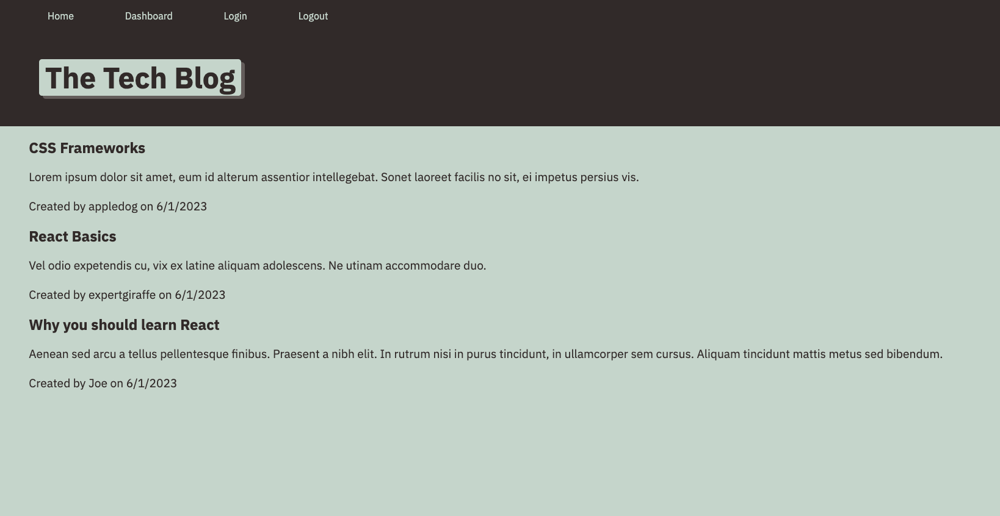

# tech-blog

The tech blog application allows users to see and share blog posts. To run the program in a production environment, type the npm start command in the terminal and go to http://localhost3001 in a browser. Users can create their own account and make their own blog posts that can be seen by other users. Any blog post that is created will appear on the home page. The objective of this application is to combine models, views, and controllers to form a functional program for reading and posting blog articles.

## Link to the Deployed Application

https://dock-tech-blog.herokuapp.com/

